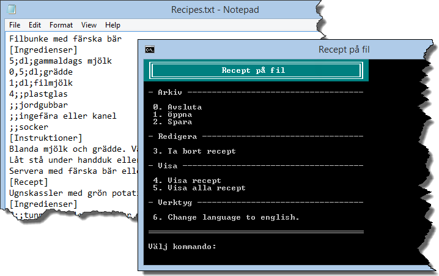

<<<<<<< HEAD
3.1 Recept på fil
=================
[3-1-recept-pa-fil.pdf](https://github.com/1dv402/kursmaterial/raw/master/Laborationsuppgifter/3-1-recept-pa-fil.pdf)

"Du ska komplettera en något större applikation för hantering av recept. Applikationen är i stort färdig men behöver kompletteras med fyra metoder för att det ska gå att visa recept, hämta recept från och skriva recept till en textfil...."
=======
1DV450_ms223uh-3-1-recept-pa-fil
================================

3-1-recept-pa-fil
>>>>>>> dc265a2255da475ad06bdafb29969f2373def05c
